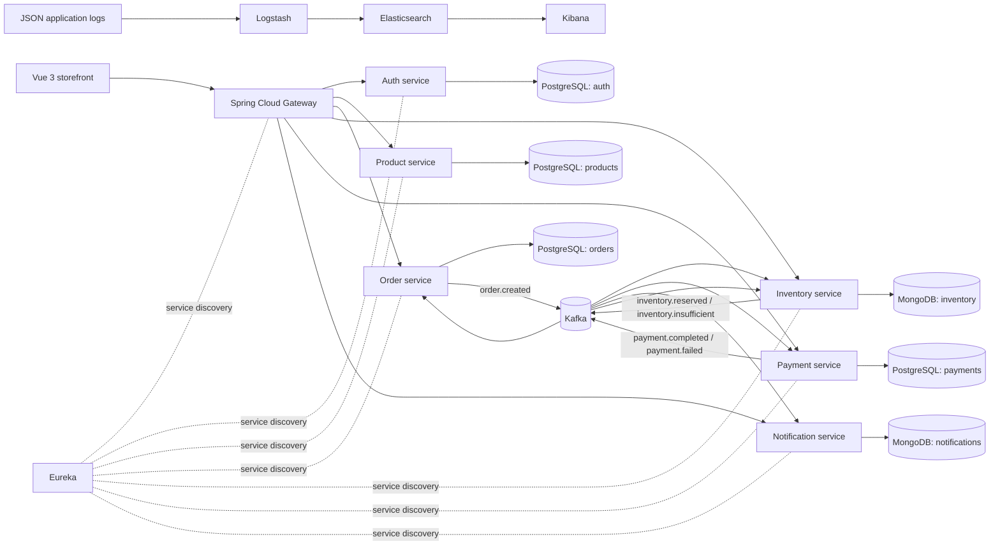

# Architecture

## Runtime Shape

Each backend project has a separate `pom.xml`, configuration, Spring application, and persistence boundary. The shared Dockerfile is only a build convenience; it produces a separate executable image for each service.

## Security Boundaries

Auth stores BCrypt hashes, issues one-hour HMAC JWTs, and defaults registrations to CUSTOMER. Admin bootstrap is disabled unless both `SHOPSPHERE_ADMIN_EMAIL` and `SHOPSPHERE_ADMIN_PASSWORD` are configured. The gateway verifies signatures, expiry, and required claims, removes incoming `X-User-Id` / `X-User-Role`, then adds values from the verified claims. Catalog reads are public; catalog and inventory mutations require ADMIN. User-facing order, payment, and notification requests are scoped by gateway-provided identity headers.

Backend service ports are internal by default in Compose. The optional development override publishes them for debugging; do not expose those ports in an untrusted network because identity headers are a gateway-to-service contract, not independent service authentication.

## Resilience Notes

Kafka listeners use four attempts with exponential delay and retry-topic/DLT support. Consumers are idempotent: order-service records each handled `eventId` in `processed_events` in the same transaction as the aggregate update, status transitions are guarded so a late `payment.completed` cannot revive a cancelled order, inventory reservations are keyed per order, payments have a unique order constraint, and notification persistence is keyed by event ID.

The order flow compensates in both directions rather than only forward: inventory rolls back earlier lines when a later line is short, and a declined payment releases whatever the order still holds. Payments are simulated by `SimulatedPaymentGateway`, which declines deterministically above `shopsphere.payment.decline-above-amount` so the failure path is reachable on demand.

The example does not include a transactional outbox, a schema registry, distributed tracing, or a production-grade DLT replay workflow. Publishing happens after the database commit, so a crash in between loses the notification but never double-charges; an outbox plus relay is the fix. See [kafka-events](kafka-events.md) for the topic-by-topic contract.